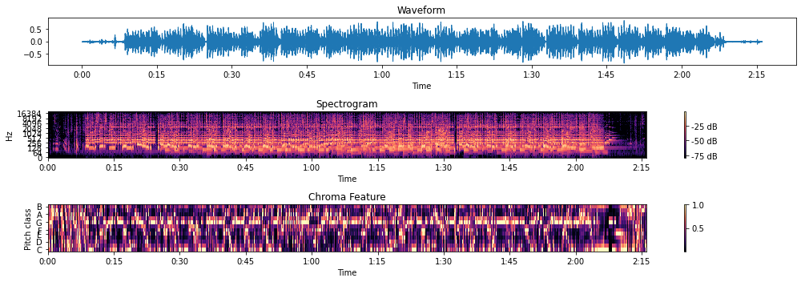

# Instructor Feedback on Experimenting with Datasets Update

## General Comments

I’m very impressed with your Experimenting with Datasets update! You explored a wide range of methods and even started augmenting your data, which is fantastic. One area for improvement is the structure of your repository. It was difficult to discern how everything in the folder fit together. I noticed the `Selected Methods.md` file in your root folder, which I assume is relevant to this assignment, but it didn’t clearly map to your code. Adding more explicit connections between your documentation and code would be helpful, and would also enable you to reflect on your methods more effectively.

Additionally, you didn’t provide details about how you divided the labor for this assignment, so I’ll rely on your Git history to assess that aspect. That said, I think you’ve done a great job overall, and I’m excited to see what you produce for the final project!

## Specific Feedback

### Demo Notebook Feedback

Your code in this notebook worked well, though I noticed that you hard-coded the file path to the MP3 file, which wasn’t included in the repository. Fortunately, I was able to locate the file and run the code. Your write-up on how you calculated different features and their meanings was excellent. To enhance clarity, consider adding a visualization, such as a spectrogram, to illustrate the frequency of the song. For example, here’s a spectrogram I created with your demo song:

Overall, well done on this notebook, which I believe was completed by Shoi based on the Git history.

### Lyric Sentiment Notebook

The code in this notebook worked well, and the use of sentiment analysis was intriguing. However, I would have appreciated a write-up explaining your goals for this analysis and your interpretation of the results. It might also be interesting to explore whether your sentiment analysis aligns with your key and seasonality analysis. Overall, great work on this notebook, which I believe was completed by Yuktha based on the Git history.

### Music Data Exploration Notebook

This notebook was well-executed, and I particularly appreciated the comments throughout. Your exploration of the relationship between recession periods and musical genres was fascinating. You might consider controlling for the overall increase in pop songs compared to all songs to determine whether the recession effect is still significant or if it reflects a general trend. Excellent work on this notebook, which I believe was completed by Weiting based on the Git history.

### Music Data K-Means Cluster Notebook

This notebook was also well-done, with detailed comments and thoughtful interpretations. Clustering by musical features is a smart approach. I’m curious if you could analyze the two time periods from the Music Data Exploration notebook to explore the variance between them. Great work on this notebook, which I believe was also completed by Weiting based on the Git history.

### song lyric analysis Notebook

I was impressed by your use of the Genius API to retrieve song lyrics. However, you pushed your API key to the repository, so I strongly recommend removing it for security reasons. The word cloud visualization was a creative way to display the most common words in the songs. I’m curious if this dataset is being used for the sentiment analysis in other notebooks. Overall, great job on this notebook, which I believe was completed by Jeff based on the Git history.

### Time Series Model Notebook

I’m incredibly impressed that you attempted to use ARIMA to model song lengths over time. Your detailed comments on the code were much appreciated. I suggest looking into the relationship between genre and song length to uncover potential correlations. Overall, this was an excellent notebook, which I believe was completed by Weiting based on the Git history.

## For Final Project Submission

For your final project submission, I recommend consolidating some of the analyses and visualizations from your notebooks into a cohesive narrative. This will help present your findings more clearly and effectively. Additionally, your reflections and interpretations will be invaluable for future users of your dataset. I suggest incorporating relevant peer-reviewed scholarship from the Computing Cultural Data assignment to provide further grounding for your dataset and to guide others in using it responsibly.

You’re in a very strong position for the final project submission, and I’m excited to see it all come together!